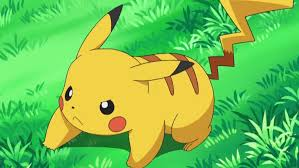
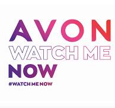

<html lang="es"><head>
  <meta charset="UTF-8">
  <link rel="shortcut icon" href="https://cdn.icon-icons.com/icons2/2415/PNG/512/bootstrap_plain_logo_icon_146619.png" type="image/x-icon">
  <meta name="viewport" content="width=device-width, initial-scale=1.0">
  <meta name="description" content="Pagina de Ejemplo para Proyecto Web Basico con HTML5, CSS de IHC">
  <meta name="keywords" content="HTML, Bootstrap, CSS, JavaScript">
  <meta name="author" content="Eduardo Luis Fernandez">
  <link rel="stylesheet" href="https://cdn.jsdelivr.net/npm/bootstrap@5.1.0/dist/css/bootstrap.min.css">
  <title>Mini Blog con Bootstrap</title>
  <link rel="stylesheet" href="style.css">
  

</head>

<body>
    

        <nav class="navbar navbar-expand-lg navbar-dark bg-primary mb-4">
          

            <a class="navbar-brand" href="#">Bienvenidos a mi Blog personal  de prueba</a>
            <button class="navbar-toggler" type="button" data-bs-toggle="collapse" data-bs-target="#navbarNav" aria-controls="navbarNav" aria-expanded="false" aria-label="Toggle navigation">
              
            </button>
            

              <ul class="navbar-nav">
                <li class="nav-item">
                  <a class="nav-link" href="#">Inicio</a>
                </li>
                <li class="nav-item">
                  <a class="nav-link" href="#">Este es un blog en el cual conocemos la historia de pokemon</a>
                </li>
                <li class="nav-item">
                  <a class="nav-link" href="https://www.crunchyroll.com/es">Servicios</a>
                </li>Entretenimiento familiar.

                <li class="nav-item">
                  <a class="nav-link" href="https://www.bing.com/ck/a?!&&p=481fe4e694a7b8b2JmltdHM9MTcxMzY1NzYwMCZpZ3VpZD0yZmM3Mzg4ZC0xYjUwLTYwMWQtMTg3Yy0yY2VhMWE0YzYxMzMmaW5zaWQ9NTE5NA&ptn=3&ver=2&hsh=3&fclid=2fc7388d-1b50-601d-187c-2cea1a4c6133&psq=outlook&u=a1aHR0cHM6Ly9vdXRsb29rLmxpdmUuY29tL21haWwvb3dhP25scD0x&ntb=1">contacto:eduluf@hotmail.com</a>
                </li>
              </ul>
            

          

        </nav>

    <main>
      

        <section class="col-md-8">
          <h2 class="h4">Que significa pokemon </h2>
          <article>
            <h3>  </h3>
            
            
 Una contracción del japonés Poketto Monsutā, que significa monstruo de bolsillo.
                 
                En el principio se creo como un anime el cual se hizo popular en los años 90, estos tienen un parecido a los animales que existen sin embargo esto tienen poderes.
            

              <a href="https://conceptodefinicion.net/pokemon/" class="btn btn-primary">Ver más</a>
          
  </article>
          El concepto detrás de Pokémon se originó en la infancia de Satoshi Tajiri, cuando pasaba horas observando y capturando insectos (como te hemos contado más arriba 🤓). Fue ese amor por la naturaleza, combinado con su fascinación por los videojuegos, lo que le llevó a imaginar un mundo lleno de criaturas únicas y asombrosas que las jugadoras podrían descubrir con ese deseo de aventura tan propio de la infancia.
          
          <article>
            <h3>Top 10 de los pokemon mas famoso en la serie</h3>
           

  

    

      
    

    

      
    

    

      
    

  

  <button class="carousel-control-prev" type="button" data-bs-target="#carouselExample" data-bs-slide="prev">
    
    Previous
  </button>
  <button class="carousel-control-next" type="button" data-bs-target="#carouselExample" data-bs-slide="next">
    
    Next
  </button>

            
Estos fueron en su gran mayoria capturado y utilizado en batalla por Ash.

              <a href="https://www.lamega.com.co/tendencias/series/top-10-de-los-pokemon-mas-famosos-de-la-serie" class="btn btn-primary">Ver más</a>
          </article>
          Con 22 años desde la emisión del primer capítulo en abril de 1997, hoy en día el proyecto animado sigue teniendo un papel importante en la memoria de millones de personas que aún recuerdan las pokebolas y evoluciones de sus personajes favoritos.

Este es el top 10 de los Pokémon que lograron destacarse por encima del resto por sus poderes, nombres y aspecto.
          <article>
            <h3>Pikachu</h3>
            
            
Su nombre proviene de la unión de las palabras en japonés pika, que es el nombre de un lagomorfo (el orden al que pertenecen conejos y liebres) de origen en Norteamérica y Asia, los ochotónidos o de pikapika, la onomatopeya japonesa que describe las chispas eléctricas, y chuchu, onomatopeya japonesa del sonido producido por un un ratón, para darle un sonido tierno
                Pikachu almacena una gran cantidad de electricidad en sus mejillas. Estas parecen cargarse eléctricamente durante la noche mientras duerme. Las mejillas de Pikachu también pueden ser recargadas mediante una descarga eléctrica, como se ha podido observar en algunos episodios del anime. A veces suelta unas pequeñas descargas cuando se acaba de despertar. Las mejillas son las que generan electricidad, pero esta es conducida y descargada por la punta de su cola produciendo descargas eléctricas, que aumentan de poder dependiendo del estado de ánimo de Pikachu. Muchas veces, en las tormentas se juntan y absorben electricidad de los relámpagos.
            

              <a href="https://pokemon.fandom.com/es/wiki/Pikachu" class="btn btn-primary">Ver más</a>
          </article>Pichu evoluciona a Pikachu por amistad con su entrenador, subiendo un nivel. Pikachu evoluciona a Pikachu y pikachu a Raychu

          Raichu exponiéndolo a una piedra trueno.
          Raichu de Alola exponiéndolo a una piedra trueno, en Pokémon Sol y Pokémon Luna.
        </section>

        <aside class="col-md-4">
          <h2 class="h4">Publicidad</h2>
          

            
            
 Tu mejor opcion para entreterte si eres amante a los animes.
               

              <a href="https://www.crunchyroll.com/es" class="btn btn-success">Ver Publicidad</a>
          

          

            
            
AVON presenta su nueva identidad con la campaña "Watch Me Now", que refleja su cambio global, así como su propósito de crear un mundo mejor transformando la vida de las mujeres a través de una imagen y valores renovados: optimismo, inclusión, audacia e inspiración.

              <a href="https://controlpublicidad.com/empresas-y-negocios-publicidad/avon-presenta-su-nueva-imagen-de-marca/" class="btn btn-success">Ver Publicidad</a>
        

          

            
            
En este verano dale la vuelta al calor con agua Ciel a solo 8 pesos la botella y contribuye con el medio ambiente con nuestra botella ecologica

             <a href="https://concepto.de/wp-content/uploads/2020/12/Ejemplo-de-anuncios-publicitarios-agua.jpg" class="btn btn-success">Ver Publicidad</a>
        

        

            

                <iframe class="ratio ratio 16x90" src="video.mp4" title="YouTube video player" frameborder="0" allow="accelerometer; autoplay; clipboard-write; encrypted-media; gyroscope; picture-in-picture; web-share" referrerpolicy="strict-origin-when-cross-origin" allowfullscreen></iframe></iframe>
            

            
Conéctate para disfrutar del episodio 1 de la serie Viajes Pokémon, cuando Ash y Pikachu todavía no eran compañeros.

            Sigue los encuentros de Pichu (que con el tiempo evolucionará a Pikachu 😉) con un grupo de Kangaskhan, el singular Mew ¡y muchas más aventuras!

            <a href="https://youtu.be/JhUqf_fhgeA" class="btn btn-success">Ver más Videos</a>
        

       
      </aside>

    </main>

    <footer class="bg-primary text-white mt-4">
        @2024- Hola soy Eduardo Visitame en esas Redes</footer>

  

   

    <button class="Facebook" onclick="window.open('https://www.facebook.com/', '_blank')">Facebook</button>
    <button class="Instagram" onclick="window.open('https://www.instagram.com/', '_blank')">Instagram</button>
    <button class="Youtube" onclick="window.open('https://www.youtube.com/', '_blank')">Youtube</button>
    
    

  

</body></html>
